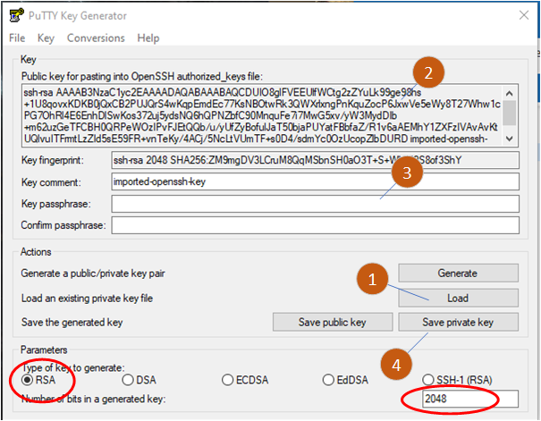
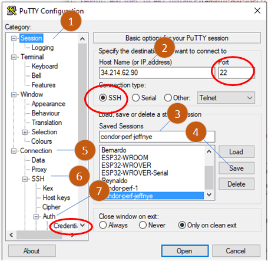
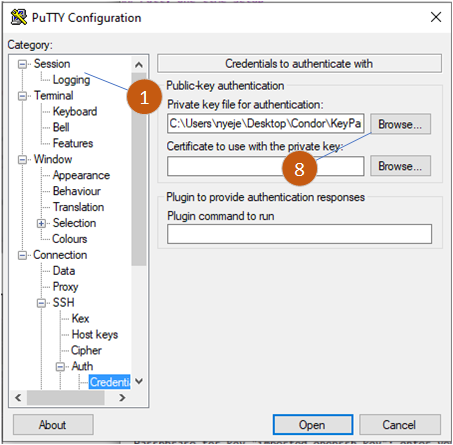
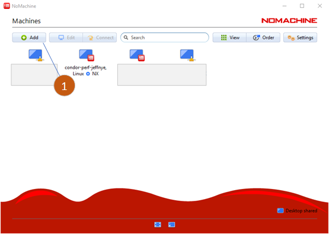
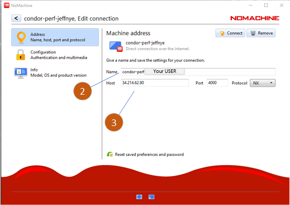
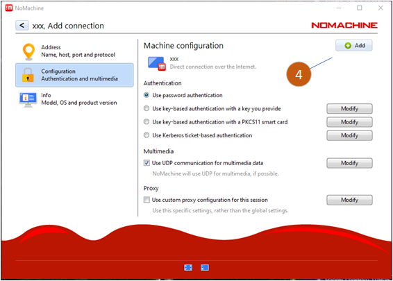

# AWS-How-To
Common AWS maintenance tasks

THIS IS INCOMPLETE, WORK IN PROGRESS

--------------------------------------
# ToC

1. [Machine Info ](#machine-info)

1. [Configuring your credentials](#configuring-your-credentials)

    1. [Pre-reqs](#pre-reqs)

    1. [Convert PEM to PPK](#convert-pem-to-ppk)

1. [Login using putty](#login-using-putty)

    1. [Putty one time setup](#putty-one-time-setup)

    1. [Putty login using named session](#putty-login-using-named-session)

1. [Login using NoMachine](#login-using-nomachine)

1. [Admin: Add User to AWS instance](#admin-add-user-to-aws-instance)

    1. [Create key/pair](#create-key-pair)

--------------------------------------
# Machine Info

```
Mach name: condor-perf-1
IP name:   ip-172-31-0-208.us-west-2.compute.internal
PublicIP:  34.214.62.90
VPC ID:    vpc-0f183f312af326d5d
Subnet:    subnet-07e5279b27d056ccf
AvailZ:    us-west-2c
```
--------------------------------------
# Configuring your credentials

## Pre-reqs

- Install [PUTTY](https://www.puttygen.com/download-putty)

    - There are two tools in the install
        - putty - the terminal program
        - puttygen - the security key conversion program
    - These instructions were created using the Windows version.
        - Mac or linux folks feel free to add details for those OS.
    - I also assume you have selected a linux user name, USER below 
        - If you are on VCAD, it should be the same user name

## Convert PEM to PPK

- You will receive a .pem file from me. This will be USER.pem
    - This is an AWS RSA key pair.
- start puttygen
- reference the puttygen image below.
- make sure the bottom row has RSA selected, 2048 bits
- (1) select Load
- browse to the .pem location
- turn on all files in the file select window
- select the .pem file
- (2) cut and paste the contents of this box into a plain text file.
    - save this file as USER_akey.txt, e.g. jeffnye_akey.txt
    - Your USER_akey.txt file should be one line of text, 
        - beginning with 'ssh-rsa' and ending with 'imported-openssh-key'
        - It may look like it is on multiple lines due to word wrapping.
    - email me this file
- (3) enter a pass phrase and confirm it
    - Remember this pass phrase this will replace used when you login via putty
- (4) save the private key in file USER.ppk
- exit puttygen 



--------------------------------------
# Login using putty

This is how to login to the instance using a text console with putty. There
is a one time setup, after setup only the "Putty login using named session"
steps are used.

These are the steps for a text console time there are different steps for the NoMachine login.  See below.

- You need to have created the PPK file and the USER_akey.txt file in the 
previous steps.
- You should have sent me the USER_akey.txt (e.g. jeffnye_akey.txt) in my email at Condor.
- Once I receive this I will add your user and akey to your instance account

You can not proceed further until the steps above are completed.  Putty login uses the PPK file.  Your password is the pass phrase you used to create or akey.

## Putty one time setup
- Start putty
    - See "Fig 1. Putty main window" below
- (1) Select session on the left
- (2) Under host name add 34.214.62.90
    - This is the public IP address of the instance,
    - see more machine info at the top of this page
- Use port 22, select SSH
- (3) In saved sessions add condor-perf-USER
    - append your user name to condor-perf, condor-perf-jeffnye
- (4) Save the session
- (5) Select Connection on the left
- (6) Expand SSH submenu
- (7) Expand Auth submenu
    - Select Credentials 
        - this will open a new window
        - see "Fig 2. Putty credentials window" below
- (8) Private key file for authentication, Browse
    - Find your ppk and select it
- (1) Select session again on the left panel
- (4) Save the session again

<b>Putty one time setup is complete. Proceed to Putty login</b>


<br> *Fig 1. - Putty main window*


<br> *Fig 2. - Putty credentials window*


## Putty login using named session

- Start putty
- Find your named session, condor-perf-USER, e.g. condor-perf-jeffnye
- Load your session
- Select button Open
- A window will open
- Login as:  USER        (e.g. jeffnye)
- Passphrase for key "imported-openssh-key": enter your passphrase

You should now have a text console. Test it:

```
jeffnye@ip-172-31-0-208:~$ uname -a
Linux ip-172-31-0-208 5.19.0-1023-aws #24~22.04.1-Ubuntu SMP Wed Mar 29 15:23:31 UTC 2023 x86_64 x86_64 x86_64 GNU/Linux
```

--------------------------------------
# Access AWS with VNC session


--------------------------------------
# Login using NoMachine

## Pre-reqs

- Install [NoMachine](https://www.nomachine.com/)

## NoMachine one time setup

This creates a NoMachine session. Once created the session can be used to 
launch NoMachine on the instance.

- Open the NoMachine app
- (1) Select ADD
- Select the Address section on the left
- (2) assign a name to the session:
    - condor-perf-USER,   e.g. condor-perf-jeffnye
    - this is just a name, it is not your login
- (3) Add the ip address, 34.214.62.90, port 4000, protocol NX
    - this is the IP of the EC2 instance
    - NoMachine uses port 4000. 
        - Normally you do not have to worry about this.
        - If you have port 4000 blocked, it needs to be enabled
- Select the Configuration section on the left
    - Make sure "Use password authentication" is selected
    - Make sure "Use UDP communication for multimedia data" is selected
- (4) Hit the "+ ADD" button on the top right



<br> *Fig 3. - Create a new NoMachine session*


<br> *Fig 2. - Assign name and IP address to session*


<br> *Fig 2. - Verify password authentication*

<b>NoMachine one time setup is complete. Proceed to NoMachine login</b>


## NoMachine login using named session

Unlike putty which uses your PPK and a pass phrase, NoMachine will be setup to
require a password. If we ever implement SSO this will change.
For now we'll do it this way.

You will have received an email from me with your temporary unix password.
This is the password assigned to you account. It is used for NoMachine and
any activities on linux that asks for a password.

(I realize this is different than the authentication that putty uses.)

 


STOPPED HERE

--------------------------------------
# Admin: Add user to AWS instance

I follow these instructions [LINK](https://docs.aws.amazon.com/AWSEC2/latest/UserGuide/managing-users.html#create-user-account)

## Create key/pair
- Goto https://us-west-2.console.aws.amazon.com/ec2/home?region=us-west-2#Home:
- Select Keypairs
- Select Create keypair
- For Name user USER name
- Select RSA, and .pem
- Move the generated file someplace
- Load the PEM file into puttygen
- Cut and paste the public key into a text file 
    - the instructions above go through this.
- ftp <newuser>.pem file to aws instance

## On the instance: change the permissions and create pub key

```
chmod 400 <newuser>.pem 
ssh-keygen -y -f <newuser>.pem   >   <newuser>.id_rsa.pub
```

## Create the user account

outserv-x

```
sudo adduser --home /home/outserv-x --shell /bin/bash --ingroup ccusers --disabled-password outserv-x

sudo usermod -a -G contractor
sudo usermod -a -G condorperf
```

```
sudo su -- outserv-x
cd
mkdir .ssh
chmod 700 .ssh
touch .ssh/authorized_keys
vi .ssh/autorized_keys
<read in the <newuser>.id_rsa.pub into this file
STOPPED HERE


--------------------------------------
# Common problems

- PUTTY reports an unrecognized signature the first time it connects to a
  new machine
    - This is usually expected
    - Please read what is in the dialog and make an informed choice.

- If AWS refuses your credentials make sure your PPK is associated with
  your named session
    - Notice in the puttygen instructions that you saved the session twice
      in the one time setup.
        - Once to give the session a name
        - Once to assign the PPK file for the session

- You will get denied access if:
    - I have not setup your AWS account yet
    - If I have done it wrong
    - Either way send me an email

- If the NoMachine access times out it may be becuase the system rebooted
  and the NoMachine service daemon did not restart
    - Send me an email
    - Or if you have root/sudo credentials restart the nxclienta
        -  sudo nxserver --restart nxd
    - Test restart success with
        - sudo /etc/NX/nxserver --status
        - ps -ef | grep nxd


