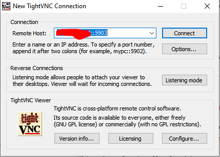
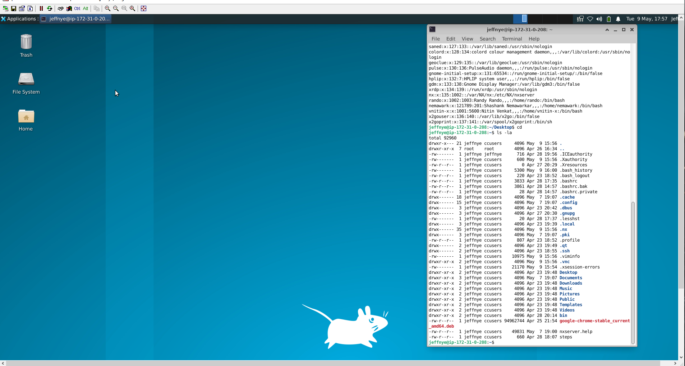

# VNC Setup, multiple user

Instructions for setting up vnc on an AWS Ubuntu 22.04 instance.

As an end user you do not have to do the AWS steps. If you are setting
up an AWS instance then there is some useful information in that step.

End user (skips the 1st two steps), do this as an end user.

-  Configure user xstartup
-  Install local tightvnc on Win/Mac
-  Log in from Win/Mac using tightvnc

AWS instance owner, or the curious, then do all the steps.

I install both xfce and gnome desktop on the instance, but I only show 
xstartup for xfce.

To save disk I'm debating removing gnome completely or switching 
to gnome-minimal, I have not tested any gnome steps.  If you want to 
configure gnome in your startup there are multiple sources on the web for this.

I am documenting this on an instance that is already running, so there might 
be some implicit state that is not reproduced here. Time will tell.

Steps:
- Configure AWS
- Install tightvnc and collateral
- Configure user xstartup
- Install local tightvnc on Win/Mac
- Log in from Win/Mac using tightvnc

The vnc install specific stuff mostly came from:
[HERE](https://bytexd.com/how-to-install-configure-vnc-server-on-ubuntu/)

--------------------------------------------
# Configure AWS
- Log into AWS dashboard
    - mine is [here](https://us-west-2.console.aws.amazon.com/ec2/home?region=us-west-2#Home:)
    - Make sure you are in the right AZ or you will not see the correct
      running instances

- Select Instances (running) 
- Select the instance you want to have VNC enabled on
- Select the Security tab
- Select the blue text under "Security groups"
    - <hash>(launch-wizard-2)
- Select Edit inbound rules
- Select Add rule (or edit existing rule, see below)
    - Make these settings
    - Type       -> Custom TCP
    - Protocol   -> TCP (read only)
    - Port range -> 5900-5910
    - Source     -> Anywhere IPv4   from the drop down
- Save rules

- OR edit an existing rule adding ports 5900-5910
    - 5910 will allow ~8 vnc sessions
    - 5900 - reserved
    - 5901 - reserved
    - 5902-5910 - user range
 
--------------------------------------------
# Install tightvnc and collateral

```
    sudo apt install tigervnc-standalone-server xfce4  xfce4-goodies ubuntu-gnome-desktop
```

- Reboot the instance

```
    sudo init 6
```

- FIXME: consider using ubuntu-desktop-minimal instead of all of gnome

--------------------------------------------
# Configure user xstartup

I will be assigning a specific port number for each user, I hope this
makes it simpler. If you need more than one vnc session send me a slack.

```
:0  reserved n/a
:1  reserved n/a
:2  jeffnye  Jeff Nye
:3  rando    Randy Rando
:4  nemawark Shashank Nemawarkar
:5  vnitin-x Nitin Venkat
:6  TBH1
:7  TBH2
:8  TBH3
:9  TBH4
:10 TBH5
```

I am using "rando" as the user for the example. Replace rando with your
AWS user name. Replace :3 with your port number.

Change to the user in question, cd to their home, remove any previous vnc
meta data. Start a server to create the 

```
sudo su rando      # become the user
cd /home/rando     # change to home dir
rm -rf .vnc        # remove any existing .vnc directory
touch .Xresources  # initialize x resource file if missing
vncserver :3       # start a server
<enter password>   # 1st time only enter passwd
<verify password>  # 1st time only verify passwd
<y/n to view only> # I usually say no
vncserver -kill :3 # kill this server
vi .vnc/xstartup   # create an xstartup file, add text below
```

Add this to xstartup:
```
#!/bin/sh
# Start up the standard system desktop
unset SESSION_MANAGER
unset DBUS_SESSION_BUS_ADDRESS
/usr/bin/startxfce4
[ -x /etc/vnc/xstartup ] && exec /etc/vnc/xstartup
[ -r $HOME/.Xresources ] && xrdb $HOME/.Xresources
x-window-manager &
```

Save xstartup

```
chmod +x .vnc/xstartup        # 
vncserver -localhost no :3    # start your actual vnc session
```

--------------------------------------------
# Install local tightvnc on Win/Mac

## Windows
The Windows 64b install is 
[HERE](https://www.tightvnc.com/download/2.8.81/tightvnc-2.8.81-gpl-setup-64bit.msi)

For now follow the instructions given by the installer.

FIXME: uninstall and reinstall to get actual steps

## MacOS
There is no free installer for TightVNC and MacOS. 

The MacOs version is a commercial product. The form to fill out is here:
[LINK](https://www.tightvnc.com/licensing-server-macos.php). I do not
know how reliable or responsive these guys might be.

This is supposedly a compatible Java based viewer. I do not have a way 
to test this, but I would try this before going the commercial route.
[LINK](https://www.tightvnc.com/licensing-jviewer.php)

--------------------------------------------
# Log in from Win/Mac using tightvnc

These instructions were created on Windows, I do not know if it will
be substantially different on MacOS.

This is straight forward, start the app, fill in IP address and your port 
number. Hit connect. Use the default settings initially to test.

Once you hit connect you should get a login panel, enter your password.
In this mode the port number is your user ID essentially and the password
is the password you set with you either started the server or the passwd
you set when you issued vncpasswd.

The login panel should show up almost immediately. If you get a timeout
or error send me a slack with the error message.


<br> *Fig 1. - TightVnc login*


<br> *Fig 1. - XFCE desktop example*

